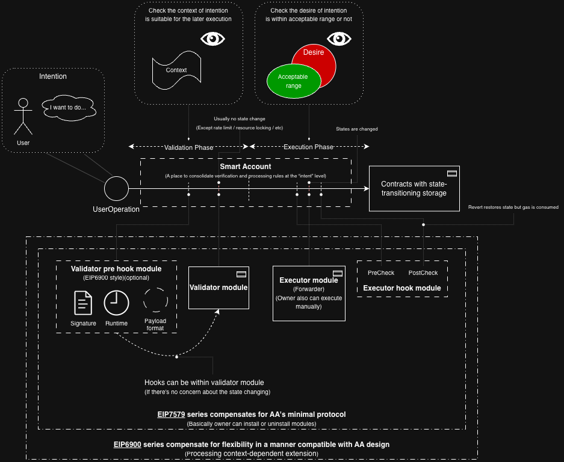
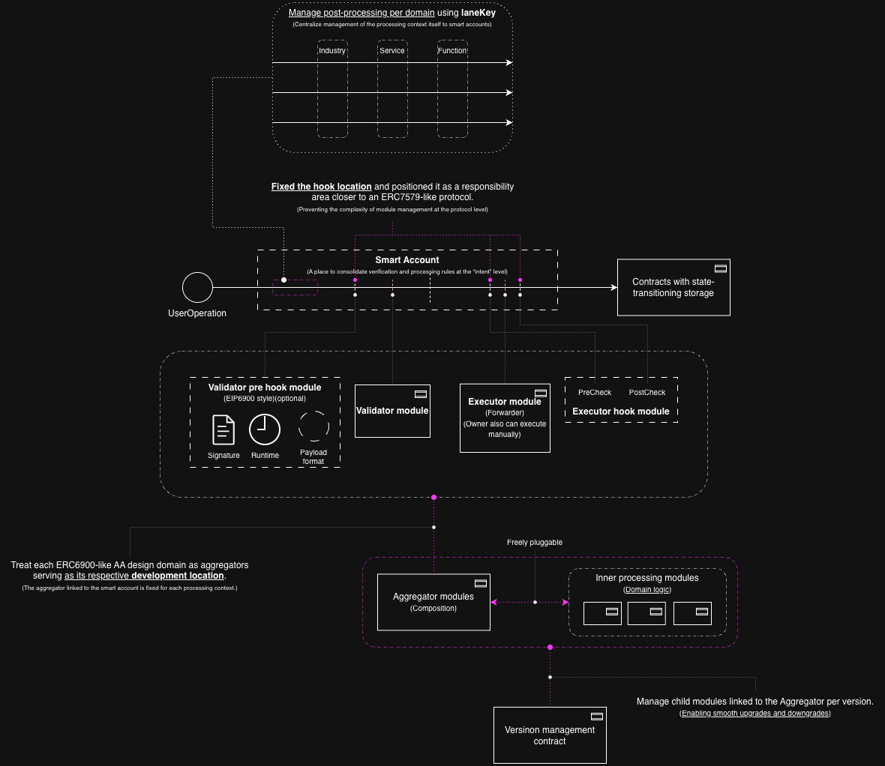

# Context Observatory(R&D) + DDD-like Account Abstraction PR

_A Modular Account Abstraction Experiment for Contextual Economics_

This repository contains an experimental **Account Abstraction + Passkey + Paymaster** flow and a frontend prototype that was verified on **OP Sepolia**.

---

## Overview

### Docs (where to read)

- **R&D / Context Observatory (thesis + DApp):** `README_RND.md`
- **AA / Aggregators / laneKey architecture:** `README_AA.md` (if present)
  - Practical dev memo on which things I encountered during implementation AA.
    - [`practical_dev_memo_en.md`](./practical_dev_memo_en.md)

### Conceptual Background (R&D)

- Context Observatory thesis & background writing:
  https://medium.com/@shoppy_humanity/list/the-conceptual-model-might-be-basic-of-ai-safety-91e6486a4aa7
- R&D doc: `README_RND.md`

This repository implements a smart contract system designed to explore a fundamental hypothesis:

> **Future liquidity will manifest not as price, but as the movement of meaning.**  
> Web3 can serve as an experimental field where this “movement of meaning” is observable as timestamped commitments on-chain.

This DApp is not merely a token mechanism.  
It is an experiment in modeling economic state as structured contextual commitments.

---

## Core Thesis

### Liquidity as the Movement of Meaning

Traditional liquidity is measured through price and numerical abstraction.

We propose:

- Economic activity can be understood as the accumulation and evolution of contextual commitments.
- Meaning moves across space, time, and interpretive granularity.
- Web3 infrastructure allows these movements to be recorded as immutable, chronological logs.

In this model:

- **NBNP is not value itself.**
- It is a log of expectation before value emerges.
- Once value stabilizes, NBNP becomes commemorative.
- The center of gravity shifts from token quantity to contextual aggregation.

> Economic state can be modeled as structured contextual commitments across space, time, and interpretive granularity.

### Background: Empathy as Liquidity (Conceptual Context)

This R&D is grounded in the following perspective:

> Because modern imagination expands across time, space, and conceptual layers,  
> liquidity increasingly binds to the _subjective resonance_ of meaning itself.  
> And resonance (empathy) is often the act of showing understanding toward _another person’s background context_.

In this DApp, a **context** is treated as that “background” artifact:
a timestamped, shareable reference that can later be aggregated into broader interpretations (epochs, declarations, and commemorative minting).

\*\*Related writing (c:contentReference[oaicite:6]{index=6}dium series: https://medium.com/@shoppy_humanity/list/91e6486a4aa7

**Related diagrams (value / empathy / emotion maps):**

- https://github.com/cancan007/society-conceptual-images

---

## Contextual Modeling Dimensions

The DApp structures meaning through:

### Spatial Scope

- `self`
- `individual`
- `organization`
- `public`

### Temporal Scope

- `past`
- `future`
- `timeless`

### Interpretive Granularity

- `summary`
- `story`
- `counterexample`

Economic trajectory emerges from:

- Mutual relational commitments
- Contextual declarations
- Referential interpretations
- Time-bounded participation

Value is abstracted from absolute numerical indicators into contextual trace.

---

# Account Abstraction Architecture

This project also explores a **modular AA architecture** for L3-oriented UX ecosystems.

**Figure 1: AA whole overview**

**Figure 2: laneKey × deterministic phases × versioned aggregators (DDD dev methodology)**

> **How to read Figure 2**:
>
> - **Top**: laneKey partitions intents into domain contexts (DDD boundary).
> - **Middle**: SmartAccount is kept stable with protocol-fixed phase touchpoints.
> - **Bottom**: aggregators act as the composition + ops surface, enabling **versioned** upgrades/rollbacks of child modules.

## Why AA becomes blurry in L3-oriented UX

In UX-driven L3 directions, the boundaries between:

- domain logic (application semantics)
- protocol guarantees (minimal safety/interop requirements)
- account-level execution rules (what an account must do)

tend to blur.

As a result, **validator logic inevitably becomes domain-dependent**, and flexibility without structure can lead to protocol opacity.

---

## Design Goals

- Keep the SmartAccount structurally stable and easy to reason about
- Push domain flexibility into **modules**
- Route execution by **laneKey** (domain boundary)
- Make validation/execution phases deterministic
- Enable evolution via **module versioning**, without migrating accounts

## Versioned Aggregators (Ops / Maintenance)

**What changed (version up):** I added a lightweight **version management layer** to the aggregator contracts so that “which module set is active” becomes an explicit, auditable onchain primitive.

Why this matters:

- In laneKey-partitioned AA, you quickly get many domains × many modules.
- Without an ops primitive, upgrades become fragile (partial upgrades, unclear active sets, hard rollback, repeated upgrades by mistake).

### Version tags (semantic, onchain)

Aggregators record module sets under a `uint96` version tag:

- `verTag = uint96(major << 64 | minor << 32 | patch)`

### Operations

Versioned aggregators support:

- `upgrade(major, minor, patch, modules...)`
  - set the new active module set
  - record the snapshot under the version tag (one-time per tag)
- `downgrade(major, minor, patch)`
  - restore a recorded snapshot (explicit rollback path)
- `activeVersionTag()`
  - returns what is active now

### Safety intention

- A version tag cannot be recorded twice (prevents accidental overwrite / replay).
- Rollback (downgrade) is treated as an explicit governance decision (discussion point: timelock / multisig / guardian).

This keeps the **SmartAccount stable** while letting domains evolve via modules with a repeatable, monitorable upgrade surface.

This aligns with the spirit of **ERC-7579 (minimal modular account interfaces & module types for interoperability)**.
Note: this repo may implement a subset / evolving subset of the interfaces as the experiment progresses.  
(ERC-7579 defines minimal required interfaces/behavior for modular smart accounts and modules.)

---

## Stable Execution Phases (protocol-fixed)

Execution phases are intentionally kept stable:

- **Validation Phase**: optional `preHook` (0 or 1)
- **Execution Phase**: fixed `preHook` → `executor` → fixed `postHook`

In other words, the **hook invocation timing is protocol-defined**, while domain flexibility is delegated to modules.

---

## laneKey as Domain Boundary (DDD-aligned)

Domain contexts are identified via `laneKey`.

Each `laneKey` maps to a fixed set of module slots:

- `validatorAggregator`
- `executorAggregator`
- `validationPreHookAggregator` (optional)
- `executionPreHookAggregator` (fixed)
- `executionPostHookAggregator` (fixed)

This provides:

- clear domain separation
- deterministic routing without SmartAccount bloat
- per-domain module evolution / rollback

---

## Aggregator Modules (extensibility without SmartAccount mutation)

Instead of making the SmartAccount itself “infinitely pluggable”, we use **Aggregator modules**:

- **ValidatorAggregator**: can fan-out / compose multiple validators
- **ExecutorAggregator**: can route / compose execution policies
- **HookAggregators**: can fan-out multiple hooks while keeping protocol positions stable

This keeps the SmartAccount simple, while enabling controlled extensibility.

### Validation preHook (runtime/signature/userOp observable)

A `validationPreHookAggregator` is designed to _observe_:

- runtime context
- signature bytes
- (packed) user operation payload

Its purpose is to provide a standard-ish observation point.
It can be initially empty (no-op) if no state change risk is desired, and can be enabled later.

---

## Where ERC-6900 fits (configuration & observability)

We use **ERC-6900** primarily as a _configuration/observability vocabulary_:

- permissioned module management
- introspection / “what is installed”
- configuration updates with clear diffs/events

Domain flexibility itself (allowlists, selector routing, spend limits, rate limits, policy versions)
should live inside modules, not inside the SmartAccount core.

(ERC-6900 standardizes modular smart contract accounts and account modules/plugins,
emphasizing secure permissioning and interoperability.)

---

## Account Abstraction (ERC-4337 v0.7 + laneKey domain config)

This repo also contains an experimental **SmartAccount** scaffold:

- **ERC-4337 EntryPoint v0.7** style `validateUserOp(PackedUserOperation)`
- **ERC-7579-ish modules**: validator / executor / hook (install/uninstall)
- A 192-bit **laneKey** represents the “domain context” (e.g. `industry/app/action`).
- Per-lane configuration is stored as `LaneConfig { validator, validationHook, executor, execHook }`.
- Execution hooks are fixed at the protocol level: **pre** + **post**. To keep SmartAccount simple, use a single hook module per lane (recommended: `ExecutionHookAggregator`) that internally fans out to N pre/post hooks.

### Manual lane selection without changing the execute() signature

`SmartAccount.execute(to, value, data)` accepts either:

- **raw**: `data == innerCallData`, laneKey defaults to `0`
- **wrapped**: `data = abi.encode(uint192 laneKey, bytes innerCallData)`

So the lane can be selected purely by how you encode `data` (no new params).

> Tip: For UserOps, bind execution to validation by using `executeUserOp(..., fullNonce)` and enforcing `fullNonce == userOp.nonce` in a validation hook (e.g. `NonceBoundCallDataValidationHook`).

--

## Toward Meaning-Aware Validation

As AA validators become domain-dependent (inevitable in L3 UX-heavy systems),
we propose exploring a lightweight recommendation layer for:

- meaning-structure-aware validation
- contextual reference modeling
- commitment structuring

This may require:

- a new discussion framework
- a classification separate from protocol-level EIPs
- recommended patterns for semantic AA modules

--

## Recent implementation updates

The AA side of this repository has been further clarified in implementation:

- passkey credentials are now stored in `SmartAccount`, not in shared validator modules
- `PasskeyValidator` is stateless and reads user-specific credential data from the account
- lane-specific validators/executors are treated as shared developer-managed modules
- `AccountFactory` now serves as a bootstrap registry for laneKey-based shared aggregators

This means a new user account can be created with a much simpler flow:

1. deploy/create `SmartAccount`
2. automatically attach pre-registered lane modules via `AccountFactory`
3. store the user's passkey credential in the account
4. begin using the application

This preserves:

- user-local identity material in the account
- developer-controlled operational composition in shared module infrastructure
- stable SmartAccount core logic

---

## Architectural Goals

- Keep SmartAccount minimal and stable
- Push contextual flexibility into modules
- Route execution via laneKey
- Maintain deterministic validation/execution phases
- Enable contextual evolution without SmartAccount mutation

---

## Long-Term Vision

This repository is a prototype for:

- Context-native SuperApps
- Structured intent routing
- Meaning-based liquidity observation
- Domain-partitioned account abstraction

It explores the hypothesis that:

> The next stage of Web3 infrastructure will abstract economic activity from price to contextual trace.

---

## For Ethereum Magicians (quick discussion entry)

**Novelty (claimed):** treating _operations_ as a first-class primitive in modular AA — **deterministic phase touchpoints + version-tagged aggregator module sets** — so the SmartAccount doesn’t need frequent rewiring.

### Questions (feedback requested)

1. **Rollback / downgrade safety**: should `downgrade()` exist? If yes, what governance model is sane (timelock / multisig / guardian)?
2. **Monitoring**: should aggregators emit a **module-set hash** (or canonical event schema) for offchain monitoring?
3. **laneKey schema**: raw `uint192` split fields vs typed-hash schema to avoid collisions across ecosystems?
